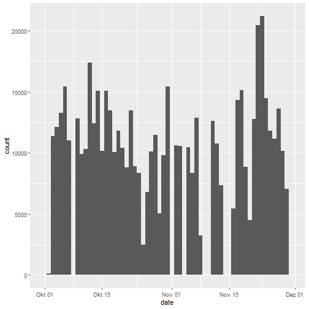
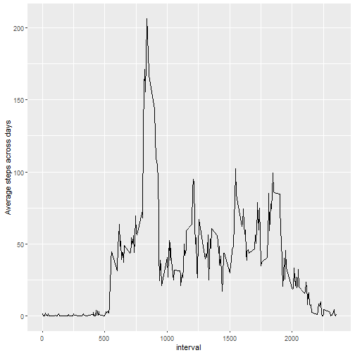
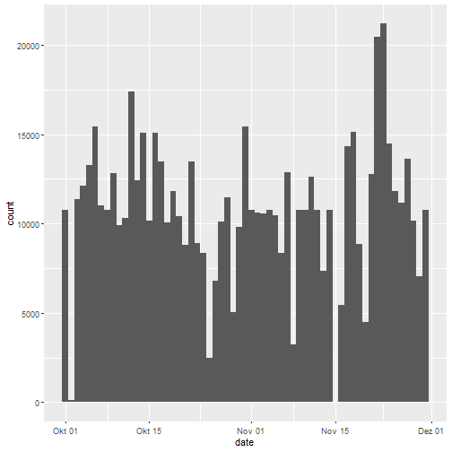
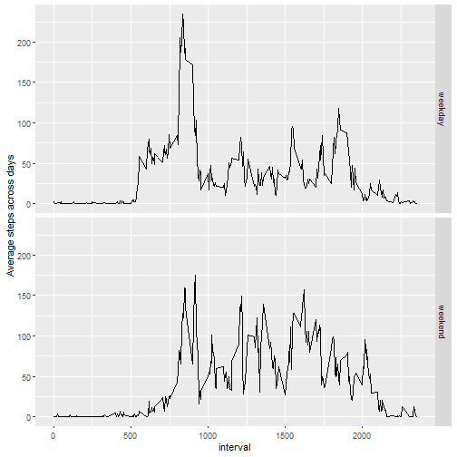

## Loading and preprocessing the data

```r
library(ggplot2)
library(dplyr)
unzip("activity.zip")
activity <- read.csv("activity.csv", stringsAsFactors = FALSE)
activity$date <- as.Date(activity$date)
```


## What is mean total number of steps taken per day?

Summary of steps per day.

```r
stepsPerDay <- activity %>% group_by(date) %>% summarise(steps = sum(steps))
summary(stepsPerDay$steps)
```

```
##    Min. 1st Qu.  Median    Mean 3rd Qu.    Max.    NA's 
##      41    8841   10765   10766   13294   21194       8
```

Histogram of steps per day.

```r
ggplot(stepsPerDay, aes(x = date)) + geom_histogram(aes(weight = steps), binwidth = 1)
```



Mean and median of the total number of steps taken per day.
Mean:

```r
mean(stepsPerDay$steps, na.rm = TRUE)
```

```
## [1] 10766.19
```

Median:

```r
median(stepsPerDay$steps, na.rm = TRUE)
```

```
## [1] 10765
```


## What is the average daily activity pattern?

Time series plot across days.

```r
aveDaily <- activity %>% group_by(interval) %>% summarise(aveSteps = mean(steps, na.rm = TRUE))
ggplot(aveDaily, aes(x = interval, aveSteps)) + geom_line() + 
    labs(y = "Average steps across days")
```



Most steps taken on average in interval 835 (8:35am).

```r
aveDaily[order(aveDaily$aveSteps, decreasing = TRUE),][1,]
```

```
## # A tibble: 1 x 2
##   interval aveSteps
##      <int>    <dbl>
## 1      835     206.
```


## Imputing missing values

Number of missing values.

```r
# matrix where element is TRUE, if corresponding element in activity data frame is NA
dfIsNa <- is.na(activity)
# vector element is 0 if no NA in row, otherwise >= 1
rowsWithNa <- rowSums(dfIsNa)
sum(rowsWithNa != 0)
```

```
## [1] 2304
```

There are 2304 columns with missing values in the acitivties data frame.


```r
summary(activity)
```

```
##      steps             date               interval     
##  Min.   :  0.00   Min.   :2012-10-01   Min.   :   0.0  
##  1st Qu.:  0.00   1st Qu.:2012-10-16   1st Qu.: 588.8  
##  Median :  0.00   Median :2012-10-31   Median :1177.5  
##  Mean   : 37.38   Mean   :2012-10-31   Mean   :1177.5  
##  3rd Qu.: 12.00   3rd Qu.:2012-11-15   3rd Qu.:1766.2  
##  Max.   :806.00   Max.   :2012-11-30   Max.   :2355.0  
##  NA's   :2304
```

The summary of the activity data.frame shows, there are only missing values in column "steps".

Create a new dataset with the missing data filled in by mean of 5-minute interval.

```r
actNoMissing <- activity
intervals <- actNoMissing[is.na(actNoMissing$steps), ]$interval
missingSteps <- numeric()
# find average value for the 5-min interval of every missing value
for(i in intervals) {
    missingSteps <- c(missingSteps, aveDaily[aveDaily$interval == i,]$aveSteps)
}
actNoMissing[is.na(actNoMissing$steps), ]$steps <- missingSteps
```

Histogram of steps per day without missing values.

```r
PerDayNoMissing <- actNoMissing %>% group_by(date) %>% summarise(steps = sum(steps))
ggplot(PerDayNoMissing, aes(x = date)) + geom_histogram(aes(weight = steps), binwidth = 1)
```



Mean and median of the total number of steps taken per day with missing values imputed.
Mean (missing values imputed):

```r
mean(PerDayNoMissing$steps)
```

```
## [1] 10766.19
```
The mean didn't change and stays the same.

Median (missing values imputed):

```r
median(PerDayNoMissing$steps)
```

```
## [1] 10766.19
```
The median is slightly higher, it is the same as the mean value now, because the value was imputed for the missing values.

The imputation of missing values has only a very low impact of the mean and meadian.


## Are there differences in activity patterns between weekdays and weekends?


```r
activity$weekTime <- ifelse(weekdays(activity$date,abbreviate = T) %in% c("Sa","So"), "weekend", "weekday")
WeekTimeAve <- activity %>% group_by(interval, weekTime) %>% summarise(aveSteps = mean(steps, na.rm = TRUE))
ggplot(WeekTimeAve, aes(x = interval, aveSteps)) + geom_line() + 
    labs(y = "Average steps across days") + facet_grid(weekTime ~ .)
```



Apperently the person is getting up earlier on weekdays but is moving more during the day on weekends.
